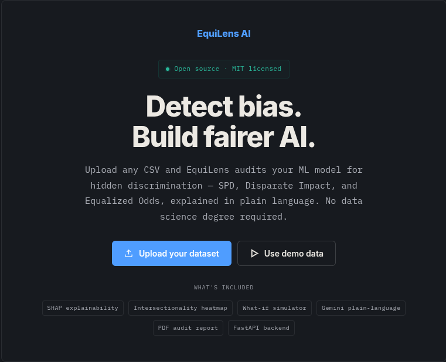
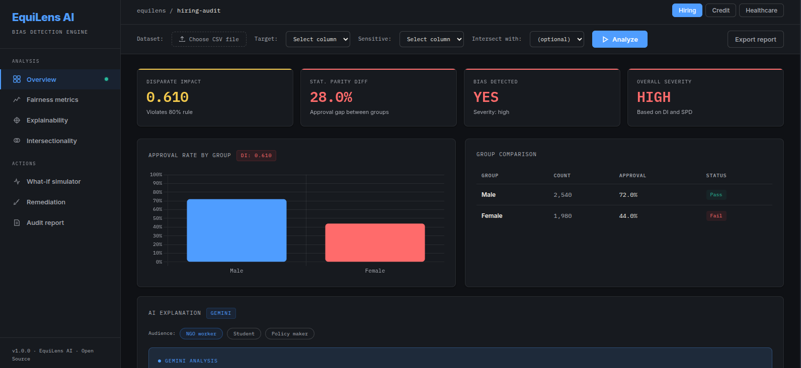
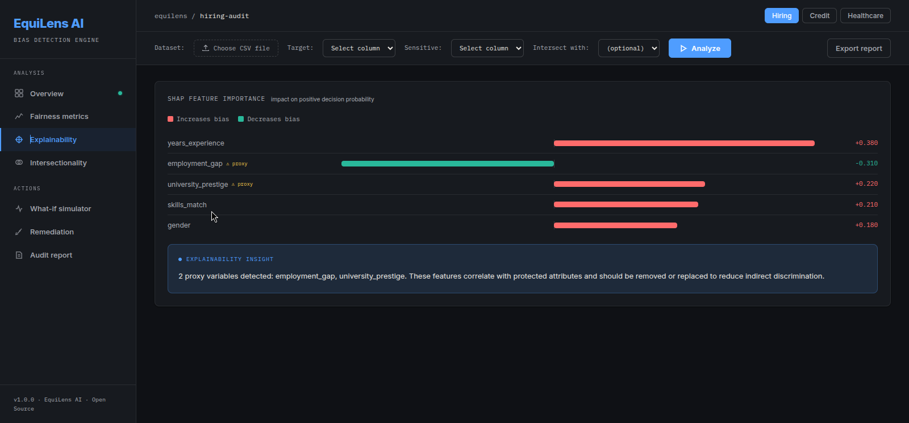
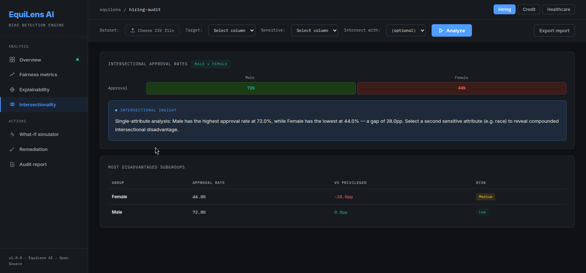
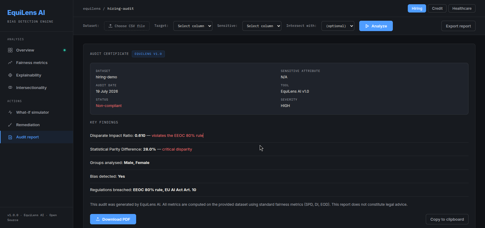

# EquiLens AI
### AI-powered bias detection for non-technical users

[](https://equilens-ai.onrender.com/)
[](https://python.org)
[](https://fastapi.tiangolo.com)

> Amazon scrapped an experimental hiring tool after it was found to penalise CVs that mentioned women's activities. ProPublica reported that the COMPAS risk tool wrongly labelled Black defendants who did not reoffend as high risk at nearly twice the rate of white defendants. Bias like this can be measured before a system is deployed; EquiLens is built to help with that.

---

## The Problem

AI makes life-changing decisions about jobs, loans, and healthcare. When trained on biased historical data, these systems don't just repeat discrimination — they amplify it at scale, silently, with no accountability.

## The Solution

EquiLens gives any organization — NGO, school, small business — the ability to audit their data for bias before it causes harm. No data science degree required.

---

## How It Works

1. Upload your CSV dataset
2. Select your target column and sensitive attribute
3. Optionally select a second sensitive attribute for intersectional analysis
4. EquiLens computes SPD, Disparate Impact, and Equalized Odds
5. SHAP explains which features are driving bias
6. Gemini translates everything into plain language
7. Intersectionality heatmap reveals compounded disadvantage across identity combinations
8. What-if simulator lets you drop features and measure bias impact in real time
9. Download a full PDF audit report

---

## Screenshots







---

## Example Scenario

Imagine Priya, who runs an NGO in Pune distributing scholarships. She uploads her dataset, selects gender as the sensitive attribute and caste as the intersect. She discovers that lower-caste girls are approved at **8%** — far below the 34% rate for upper-caste boys. A Disparate Impact of **0.24**, well below the legal threshold of 0.8. Gemini explains this in plain language and suggests fixes. Priya downloads the audit report and shares it with her board.

---

## Tech Stack

| Layer | Technology |
|-------|-----------|
| Backend | FastAPI (Python 3.11) |
| Bias Metrics | SPD, Disparate Impact, Equalized Odds |
| Explainability | SHAP (TreeExplainer) |
| AI Layer | Gemini 2.5 Flash |
| Frontend | HTML / CSS / JS + Chart.js |
| PDF Export | ReportLab |
| Deployment | Render |

---

## Fairness Metrics

| Metric | Threshold | Meaning |
|--------|-----------|---------|
| Disparate Impact | < 0.8 = biased | Legal standard (EEOC 4/5ths rule) |
| Statistical Parity Difference | > 0.1 = biased | Outcome gap between groups |
| Equalized Odds | > 0.1 = biased | Error rate gap between groups |

---

## What Makes EquiLens Different

Toolkits such as IBM AI Fairness 360, Fairlearn and Aequitas are built mainly for data scientists. EquiLens adds a Gemini-generated plain-language layer on top of its metrics, tuned to who's reading:

| Audience | Output |
|----------|--------|
| NGO worker | Policy implication |
| Student | Learning-oriented explanation |
| Policy maker | Legal risk framing |

---

## Setup

```bash
git clone https://github.com/CheerathAniketh/EquiLens-AI
cd EquiLens-AI/backend
pip install -r requirements.txt
```

Create a `.env` file in the `backend/` folder:

```env
GEMINI_API_KEY=your_api_key_here
```

Run the server:

```bash
uvicorn main:app --reload
```

Open `http://127.0.0.1:8000` in your browser.

---

## What's Built

### Backend
- FastAPI server with CORS middleware and multi-user session management
- CSV upload and parsing via `/analyze` endpoint
- Bias metrics computed locally: SPD, Disparate Impact, Equalized Odds (real TPR/FPR per group)
- SHAP feature importance via `explainer.py`
- Model training and evaluation via `trainer.py` (RandomForest, ROC + calibration curves)
- Gemini 2.5 Flash for plain-language explanations with audience toggle
- Graceful fallback when Gemini quota is exhausted or API key is missing — dynamic, not hardcoded
- Fallback responses marked with `*` so developers know Gemini is offline
- Smart label decoding: encoded columns (0/1/2...) mapped to human-readable names
- String target column support (`yes/no`, `hired/rejected`, `>50K/<=50K`)
- Real intersectionality via `compute_intersectionality()` — every (col1 × col2) subgroup pair
- Cells with fewer than 10 samples excluded and marked null to avoid misleading statistics
- Real Equalized Odds via `compute_eod()` — true TPR/FPR difference per group
- `/whatif` endpoint — retrains model on reduced feature set, measures bias delta
- `/whatif/features` endpoint — returns available features from cached session
- PDF audit report via ReportLab — verdict banner, metric scorecards, SHAP bars, Gemini explanation, regulation compliance table

### Frontend
- Single-page app with sidebar navigation and landing page
- Overview: score cards (DI, SPD, severity), approval rate chart, group comparison table
- Fairness metrics: metric bars, calibration curve, ROC by group — labeled with real group names
- Explainability: SHAP feature importance bars with proxy variable detection
- Intersectionality: real heatmap from backend + subgroup table ranked worst → best
- Remediation: before/after radar charts, recommended steps
- Audit report: structured findings + copy-to-clipboard + PDF download
- Demo presets: Hiring / Credit / Healthcare with one click
- Auto-detects target and sensitive columns from CSV headers
- Drag-and-drop CSV upload
- Audience toggle (NGO / Student / Policy maker)
- Regulation compliance pills (EEOC, EU AI Act, GDPR)
- What-if simulator: feature checkboxes, before/after radar, delta cards, Gemini explanation

---

## Known limitations

- Sparse cells in the intersectional heatmap (fewer than 10 samples) are left blank, with no tooltip explaining why.
- The layout has one responsive breakpoint (900px) and has not been tested on phones.
- The loading state is a spinner, not skeleton placeholders.
- If the backend call fails, the page falls back to demo data and shows only a short-lived error notice.
- The Gemini API key is read from the host's environment variables; there is no secrets manager.

